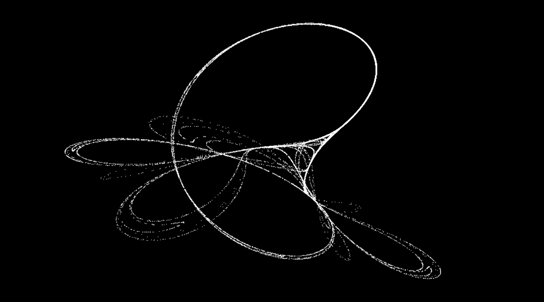

# Tinkerbell Map

The [Tinkerbell Map](https://en.wikipedia.org/wiki/Tinkerbell_map) is a class of chaotic dynamical system known as an *attractor* in which the system tends to evolove to a state or set of states.

The Tinkerbell attractor can be described by:

$$x_{n+1}=x_{n}^{2}-y_{n}^{2}+ax_{n}+by_{n}$$

$$y_{n+1}=2x_{n}y_{n}+cx_{n}+dy_{n}$$

This particular Tinkerbell system is defined by the parameters: `x_0 = -0.72; y_0 = -0.64; a = 0.90; b = -0.6013; c = 2.0; d = 0.50`

Because system values that approach the attractor values remain close even if slightly disturbed, the opposite is also true in that we can progressively vary parameters of the Tinkerbell system to observe how an identical starting position can result in significantly different patterns and create the illusion of motion/evolution.

Click here to watch the YouTube video:

This repository contains the following:
* `main.py` - Calculates the tinkerbell map with 2e4 iterations by default. Saves the image as tink_0000.png in `/figures`.
* `plotLots.py` - Performs the  same task as main.py but recalculates the Map with a varied parameter and repeats, saving an image each time.

Using `plotLots.py` you can create a series of 'related' frames yourself. I stitched mine together into a .mov using `ffmpeg`.

This code requries `numpy` and `matplotlib` and was intended for python versions 3.X. Feel free to use any or all of this code.